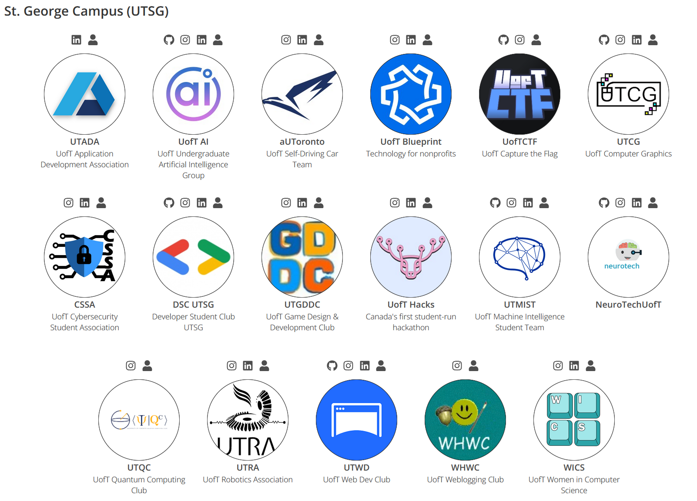

2025 Edition Version 1.6 - Last Edit July 30, 2025

    
  Edison Y.  
  Class of 2027, Computer Science Specialist 
  VP of Internal Relations 

2020 Author's Note:

> This is a heavily modified version of the original, which we use as a template. As such, most of the credit for this guide can be attributed to previous versions by past CSSU members.
> 
> Still, the field, market, and university are constantly changing by the day, so this guide is a continual work in progress; we have given the most accurate information to our combined knowledge, yet keep in mind that this is an unofficial guide created by students.
> As such, consultation with the Undergrad Office or your College Registrar should be referred to for academic inquiries or other matters regarding the university.
>
> When you're done reading, please fill out [this feedback form](https://forms.gle/MGqc7bT8HAX2dkha8) to give me and the team valuable feedback.
>
> I hope you gain something, whether it's information or inspiration, and if you see something wrong, raise an issue or even better: change it and make a PR. For those who care, this is an **open source** document. //
> Thanks for reading; we wish you the best in your CS journey!

## Audio Version with Writer's Commentary (recorded on June 29, 2020)

[Youtube](https://www.youtube.com/watch?v=TkC2dLz30NU)

[Spotify](https://open.spotify.com/episode/0HF43I3QWW4psRRjYyCjq7)

Original Credits for 2020 and 2018 Version (from which a lot of the content is sourced):
> By: Anujan M, Clara S, and the CSSU Team

---

  

Before anything, on behalf of the Computer Science Student Union (CSSU) and the CS community at U of T, we would like to congratulate everyone who has received an offer of admission to Computer Science at the University of Toronto St. George campus (or we hope you're considering / will get accepted). We're happy to have you!

This is a collection of Frequently Asked Questions (FAQs) that we think all first-year undergraduates (and, for that matter, everyone in the program) should know. This is part of a multi-faceted project to curate resources for the entire CS community, some of which will be linked to in this guide.

University can be exciting but daunting, especially in your first year. We hope this guide gives you some information and tips on how to succeed in your first year here (and we hope this guide makes you laugh along the way). If there is anything you want to add or edit to this guide, please send the CSSU a quick email or make a PR on the [Github Repo](https://github.com/cssu/first-year-guide).

---
## Table of Contents

1. [What is the CSSU?](#what-is-the-cssu) (Ice Cream Sandwiches and Video Games)
2. [Common Terms that you should know](#common-terms-that-you-should-know) (or Uni is just full of acronyms that change all the time)
3. [Course Enrollment](#course-enrollment) (or how to make a schedule that doesn't overburden you)
4. [Course Tips](#course-tips) (or how to succeed in those courses and GET HELP)
5. [Program Admission (Formerly Subject POSt)](#program-admission) (AKA most speculative/invisible monster to terrorize students in all of Canada or even the world that got a rework into a much nicer thing but is still worth paying attention to)
6. [Mental Health](#mental-health) (Really, *really* important to read and understand, it's real and we need to talk about it)
7. [How to get Involved?](#how-to-get-involved) (or how to get a balance in your life, have fun, and make friends)
8. [Jobs, Internships, and ASIP](#jobs-internships-and-asip) (or how and when to get some real-world experience)
9. [Important Links](#important-links) (KEEP THESE LIFESAVERS HANDY)
10. [Finances](#finances) (Why CS costs more and how to reduce these costs)
11. [Parting Words](#parting-words) (Not a summary!)

---
## What Is The CSSU?

So since this guide is made in coordination with the CSSU, we would like to introduce you to them. The Computer Science Student Union (or CSSU in short) represents all Computer Science students who are either taking a Computer Science course or are a part of the Computer Science program (CS Minor/Major/Specialist, Data Science Specialist) at the U of T St. George campus. We offer services and sell drinks and snacks (and 50¢ ice cream sandwiches!) out of the office in **BA2250** (Bahen Centre for Information Technology, 40 St. George Street, 2nd floor). 

    

The CSSU also hosts a ton of different events, including game nights, pancake breakfasts, town halls, and academic events, where students get to socialize with each other over pancakes, video games, and stuff they're interested in. We also sport plenty of amenities in the office; I'm talking televisions, game consoles (Xbox Original/360/X, PS2/3, Gamecube, Switch), a microwave/sink/kettles, fridges, and more! Although we represent the CS students at UTSG, the community and Bahen lounge are open to anyone and everyone from all backgrounds and fields of study; feel free to drop by, say hello, and introduce yourself! You can sign up for our email newsletter that will contain information on upcoming events [here](https://cssu.us10.list-manage.com/subscribe/post?u=987f258df56af54075e2c9696&id=6217e7727d) or join our Discord [here](https://discord.gg/R9hneMaafD).

    

> Author's note: If you play Smash Ultimate, you should stop by the lounge - we have been closely collaborating with UT Smash for their Friday and monthly tournaments. I picked up the game around the second semester of my second year and would love to find another excuse to play!

 

    

To make the transition to university a little smoother, we also run the annual First-Year CS Orientation, which happens at the beginning of the year for students to get to know each other and to be introduced to some great info. Stay tuned for more details later this summer on how it's being reworked!

Feel free to visit our website [here](https://www.cssu.ca/) to learn more about the CSSU, and first-year opportunities, or to get settled into the community. If you are *so inclined*, you could even join our web team and make it a little prettier...

---
## Common Terms That You Should Know

**ACORN**

[ACORN](https://acorn.utoronto.ca) is your one-stop shop for all the official things you need to do. From enrolling in courses and accessing your final grades to finding your tuition bills, ACORN is your go-to site.

>**_Pro Tip_**: You can plan your courses on ACORN and save them to your "cart", from which you can quickly enroll when your course enrollment period begins.

**QUERCUS** (A.K.A. Portal, or the most unpronounceable name on campus)

[QUERCUS](https://q.utoronto.ca) is the new system (migration from PORTAL happened in 2018) that most courses use to provide lecture slides, important dates, and course updates (previously, it was called Blackboard and some people still do call it). You can also submit your assignments and sometimes access your term marks (tests, quizzes, assignments, etc.) through this system. CS courses tend to use their own sites in conjunction with MarkUs (see below), but most other courses are adamant about using it (though some courses use other tools as well, so you should make sure to check the syllabus of each one of your courses to see what they are using). If you've used D2L or Blackboard, you'll find that QUERCUS is a bit familiar.

**MarkUs**

[MarkUs](https://markus.teach.cs.toronto.edu) is where you'll be submitting your work and getting feedback and marks for most (if not all) CS courses. Make sure you can log in to the site as soon as it’s available to avoid hassles that will undoubtedly arise if you can't log in on the day your assignments are due.

>**_Pro Tip_**: Always submit assignments early, since the system tends to get overloaded and is known to get extremely slow or even crash during the last few minutes before the deadline. It’s your responsibility to submit early, but also keep in mind that multiple submissions are allowed for most classes. This means only your final submission will be graded, even if you submit various drafts before the deadline. This allows you to edit and submit your work as many times as you see fit until the deadline.

**Piazza**

Many courses use [Piazza](https://piazza.com/), a course-based forum board where students can post questions and get answers from classmates and the teaching team. However, some courses don’t use Piazza and instead use Discourse or the Quercus discussion boards. These are good resources for finding answers to frequently sought-out clarifications. It should be noted that email notifications are on by default for every post, which can be annoying; go into the settings and pick the email settings that fit you.

**Ed Discussion**

[An alternative course forum](https://edstem.org/) to Piazza, but it serves the same purpose. In the past, Ed has been used in CSC110, CSC111, CSC165, CSC236, and MAT237, among other courses.  
>**_Pro Tip_**: Remember to search your question before posting it on a course forum, as it is quite likely someone's already asked your exact question. Also, profs really don't want to answer the same question 5 million times...
**Teaching Labs**

[The teaching labs](https://www.teach.cs.toronto.edu/) refer to the **actual labs** in Bahen as well as the entire online system through which you interact with the department (MarkUs, SSH (_Remote Lab Connections_), PCRS). At the beginning of the year, you'll get an email asking you to set up your Teaching Labs account. It is critical that you:

1. Don't lose the email.
2. Don't forget the password you set it with.
3. _Don't lose your mind._
   
 This is the most used login you'll need at U of T (after your UTORid login for ACORN). 

Keep in mind that CS students have 24/7 access to the labs (and Bahen) with their T-Cards. For more information about the labs, visit [their site](https://www.teach.cs.toronto.edu/), which contains [room numbers for the labs](https://www.teach.cs.toronto.edu/faq.html#GS1) and [status/uptime pages for UofT, teach servers, and Markus](https://status.teach.cs.toronto.edu/).

**Help Centre**

As one of the best places to get official help in first and second-year courses, the Bahen CS Help Center has TAs and professors ready to help you answer your questions. For a full schedule of when it’s open and who's there, visit [this link](http://web.cs.toronto.edu/program/ugrad/ug_helpcentre.htm). For upper-year courses, you should be able to get help directly from the course-specific instructors/teaching assistants (TAs), rather than general Help Centre TAs. Getting help is really, REALLY important, and you should make full use of these hours. **Note for this year, it is unknown how the help center will be run. Look for updates from your profs.**

**Undergraduate Office aka “UGO”**

For all your official program questions and concerns, make your way up to the 4th floor of Bahen to visit the undergrad office for CS. You can ask them questions ranging from program admission to financial situations, or anything to do with the CS program, really, and they will be willing to help you out. If you need any CS advice, the office is a great place to get the official answers to all of your questions.

**CS Undergraduate Quercus**

This is basically the holy grail for CS-related questions and inquiries! Have a question about academics? Check here. What about research? Also here. Maybe also… *literally anything related to CS*? Probably the Undergrad Office, but here too! Plus, they’ve got a FAQ board that you can browse to find questions *you didn’t even know you had!*
That’s not all; they revamped it last year to add events, jobs, and research opportunities on their discussion boards and announcements page – so check it out sometime! 
To enroll in the course (yes, we are aware that it’s not *actually* a course… Quercus things), check out [this link!](https://q.utoronto.ca/enroll/EMFCPB)

---
## Course Enrollment

So, the first rule of CS is to be lazy (when coding) and to avoid remaking the wheel (or the print statement). Since the Faculty of Arts & Science has already videotaped, asked, and subtitled videos on course enrollment and great tips for the University, we'll just link them here. (These were made 7 years ago, but the advice still holds). Stars 2020's John H. Moss Scholar, Former CSSU General Council Member, TA, and Orientation Organizer **Lana**; Former CSSU Vice President, UofT Hacks President, and TA **Calvin**; and 2017 Canadian Undergraduate Computer Science Conference co-chair and TA **Felipe**.

Click on the title to watch the video on YouTube (It does have subtitles, so yay!)

**[Preparing for course enrollment and what you should know](https://www.youtube.com/watch?v=MNn98NhAza8)**

**[Avoiding Burnout (and how to move on from failure) with Felipe](https://www.youtube.com/watch?v=FzrPswwkZFs)**

**[Getting to explore different fields and how that's important with Calvin](https://www.youtube.com/watch?v=YgUDhDLpZAo)**

**[UofT time and how you can have two classes back to back without the need for teleportation with Lana](https://www.youtube.com/watch?v=Sq54k8gbN8w)**

**[Calvin’s Insider Tips](https://www.youtube.com/watch?v=RW_Mr85HFto)**

A good tip: you can access course evaluations submitted by past students for more courses on [Quercus](q.utoronto.ca), which you can access by logging in (with your joinID, which will soon become your UTORid) and selecting course evaluations from the drop-down menu. You can't see specific student comments, but you can see the numerical stats; this is an especially great way to learn about elective and breadth courses! (From u/zyjerry on Reddit)
Additionally, it can be a good idea to consult RateMyProfs for more details regarding certain instructors - however, take these ratings with a grain of salt!

For more important videos with tips and information about university and course enrollment, check out the ArtSci YouTube channel [here](https://www.youtube.com/channel/UCXRrb_NqDU5IN2ensLpWbcg/videos). For an interview with Lana about her achievements and advice, check out [this episode of Room 2250](https://open.spotify.com/episode/3HZ6rqlLT1n07o1Rn2xLzQ).

### Course Planning Tools/Things to know

There are many different fields in CS and a lot of courses that range from theory to networking to graphics and everything in between. [Courseography](https://courseography.cdf.toronto.edu/graph) is an open-source project started by Prof. David Liu that charts out all the CS courses and program areas with their prerequisites. You could look at what upper-year courses interest you and take their necessary prerequisites. Note that the course offerings have not been updated to reflect the new courses for the 2025/2026 school year (as of publishing), and as always, the [calendar](https://fas.calendar.utoronto.ca/section/Computer-Science) is the place for the most up-to-date and official information.

### What is a focus?

CS Majors and Specialists can optionally enroll in one or more Focuses within computer science, as listed on the [academic calendar](https://artsci.calendar.utoronto.ca/section/Computer-Science). Focuses help students explore different areas of computer science in a guided way and allow students to formally show expertise in a particular field of CS. You may choose to enroll in a focus once you’re admitted into a Major/Specialist program **during the summer request period;** check this date on the ArtSci website for [Academic Dates & Deadlines](https://www.artsci.utoronto.ca/current/dates-deadlines/academic-dates).
For all you crazy folks out here, also note that you can enroll in as many as you would like, but also that most people regain enough sanity to only finish one or two. However, if you’d like to be a Swiss Army knife, the options are on the table for all you brave souls…

For most focuses, all CS Specialists and Majors can enroll automatically at any point in their degree. However, to enroll in the [Focus in Technology Leadership (FTL)](https://www.technologyleadershipinitiative.com/), students must complete a special application form and successfully pass any interviews. FTL aims to prepare students to take on leadership roles within the tech industry. Currently, FTL accepts about 30 students for each cohort, though they may possibly expand in future years.

Once you're in, FTL has two big draws: 
1. Industry-integrated learning 
Enrolled students must complete two specialized courses exclusively for FTL students: the industry-focused variant of CSC207H1: Software Design and CSC308H1: Technology Leadership. FTL's version of CSC207 involves an industry-integrated project that past cohorts have found extremely valuable in developing technical and soft skills.

2. Industry experience and workshops 
FTL frequently hosts networking events and workshops to help students build skills essential to leadership in tech. The program also provides support and mentorship in navigating the internship search. 

### Breadth Courses

To get your degree at UofT on top of completing 20 Credits and fulfilling a degree combination of at least a Specialist/2 Majors/1 Major + 2 Minors, you must complete Breadth Requirements:

The Breadth Requirement can be completed in one of two ways: (a) at least 1.0 credit in each of 4 of the 5 categories below, or (b) at least 1.0 credit in each of any 3 of the 5 categories, and at least 0.5 credit in each of the other 2 categories:
1. Creative and Cultural Representations
2. Thought, Belief, and Behaviour
3. Society and Its Institutions
4. Living Things and Their Environment
5. The Physical and Mathematical Universes

The Faculty of Arts and Science has a video visualizing the requirements [here](https://www.youtube.com/watch?v=ZvIGjn1YpUI).

Good news: Category 5 is automatically covered by your mandatory CS courses! The other categories encourage you to explore fields and areas of interest outside of STEM/CS. First Year is a great time to explore other fields, especially with First Year Seminars.

These seminars are small group courses that focus on specific topics and interests. You can find a full list [here]( https://artsci.calendar.utoronto.ca/section/First-Year-Foundations). 
Here are some courses that have been previously offered by ArtSci;

- WDW153H1 - Popular Culture Today I: Issues and Perspectives and WDW154H1 - Popular Culture Today II: Special Topics
- WDW196H1 - From Rayguns to Light Sabers: Science Fiction in Contemporary Culture
- VIC112H1 - Puzzles, Discovery and the Human Imagination
- SMC198H1 - How to Study Video Games
- NEW103H1 - Digital Technology and Society
- CSC196H1 - Great Ideas In Computing
- CSC197H1 - Big Data and Privacy

New courses come up every year, so feel free to do yourself a favor and check out t

Who knows? From taking a course outside your field, you might find something that interests you enough for further study... or just the credit.

---
## Course Tips

### IDEs and libraries
First-year CS courses, both in-stream and out-of-stream, are mainly focused on teaching the basics of programming and theory through the lens of Python. As such, it is heavily recommended that students install a suitable IDE (Integrated Development Environment) for their projects, exercises, and Python programming in general.

Common choices are [Pycharm](https://www.jetbrains.com/pycharm/) and [Wing101](https://wingware.com/downloads/wing-101).
Students creating a JetBrains account with their U of T email receive access to the JetBrains Educational Pack, which contains professional versions of all JetBrains IDEs, including PyCharm!

Depending on your course, certain libraries/packages may need to be installed; for further details, please refer to your course syllabi when they are published around the start of classes.

### GitHub and Version Control
[Github](https://github.com/) is a platform commonly used for programming projects, both independent and collaborative. GitHub functions as a platform to upload and host project files for you and your team while being able to remotely and simultaneously update, download, and work on code. 

Similar to JetBrains, signing up for GitHub with your U of T email provides access to the GitHub Student Developer Pack.

---
### Students who have been admitted to the CS Stream
#### **In-Stream** Schedule Notes

Visit [here]( https://web.cs.toronto.edu/undergraduate/incoming) for more information about in-stream courses.

In-stream CS students are required to take two courses exclusive to the stream.
CSC110Y1 is a half-year (semester) course; this covers content relevant to CSC108 and CSC148, which is to say the basics of Python programming. Some extra content that has been covered includes Number Theory, Proofs, and Runtime Analysis, but the focus is on getting you thinking in Python and developing the ability to parse and write code! Being worth 1.0 credits means that it's the equivalent of 2 normal half-year courses. 
CSC111H1 is a normal half-year course offered in the winter semester as a direct continuation of CSC110Y1. Content is more abstract and theoretical than 110; principally, you'll be investigating Recursion and Data Structures to help organize your programs and optimize runtime. 

It should be noted that **neither of these courses assumes any prior experience in programming or Python;** even if it's your first time coding, you'll totally be able to learn and succeed!
Naturally, you should plan your course load accordingly; if you're following a typical 5.0 credit per year full-time course load, you would ideally split that as 2.5 credits per term - that is, 5 half-year courses per term. (Full Year courses such as MAT137/MAT157 take a half credit per each term). CSC110 would take 1 of those 5 spots in the fall semester, leaving 4 electives (1 of which would be taken up by MAT137/MAT157). In the winter semester, 1 spot is taken by CSC111 and 1 by your choice of Calculus, leaving 3 electives for students strictly aiming for the CS Major/Specialist; note that DS Specialists ***must take STA130H1***. <!-- Below is a sample look at a timetable that summarizes this. -->

<!-- <Figure src="timetable.png" alt="The sample timetable is divided into two columns for Fall Term and Winter Term. Under Fall Term, it lists MAT137Y / MAT157Y, CSC110Y, Elective 1a, and Elective 2a. Under Winter Term, it lists CSC111H, STA130H (if interested in Data Science), or elective, Elective 1b, and Elective 2b." /> -->

---
### Students that were not admitted to the CS Stream (Mathematical and Physical Sciences, Life Science, Humanities, etc.)

### CSC108 vs CSC148

Year after year, many students ask whether they can skip CSC108 and go straight for CSC148. The answer is quite dependent on you and your abilities, and you won’t be favored for admission to the program if you take CSC148 during the first semester instead of the second semester.
However, the basic idea is as follows; 

- If you’re new to programming, you should take CSC108, as it’s designed for beginners and will give you the required preparation for CSC148. This is mostly an introduction to programming and will teach you fundamentals in Python.

- If you’re experienced with programming, you might want to talk with someone at the Undergraduate Office to see if you will benefit from skipping CSC108. If you do end up directly progressing to CSC148, there are ramp-up sessions held at the beginning of the semester to help you brush up on the contents of 108.

Alternatively, you could also take a look at a [past final](http://www.cs.toronto.edu/dcs/ugdocs/csc108.pdf) from 108, or look at the ramp-up slides online to get an overview of CSC108. If you feel like you don’t understand it completely, you might want to take CSC108. (Think about the best thing for you as a student –  learning the material to the best of your abilities is more important than ‘saving’ a half credit). Both courses are in Python, so even if you’re familiar with Java, we suggest you consider taking CSC108 to get familiar with Python. Consider your options well.

Note that even if you take CSC148 and then decide that you're not ready for it after taking a few classes, you can drop down to CSC108 if spaces are still available in that course.

Also, look at the department’s [page](https://web.cs.toronto.edu/undergraduate/first-year-courses) for more info on how to choose your first-year CS courses. This doesn't mention the new in-stream version; refer to the above section for more on the in-stream site.

---
### Which Math Course Should I Take?

       
  MAT237 my beloved... 😍

Before we go any further, there are a few good official resources for this section; check [this guide to First-Year Math courses](https://www.mathematics.utoronto.ca/undergraduate/current-students/guide-first-year-mathematics) and also [the MAT137Y1 vs MAT157Y1 portion of the Incoming First-Year CS webpage](https://web.cs.toronto.edu/undergraduate/incoming).

So yes, you’re thinking – this is a CS guide! Why is it talking about math courses? Mathematics and Computer Science go hand-in-hand (in particular, CSC165 and all the theory courses have a very mathematical approach). We are very much like our math counterparts on the theoretical side. This is why you'll pick a calculus course in your first year, and your options are highly varied.

The required options you’ll have are MAT135 + MAT136 or MAT137, or MAT157. Any of these will satisfy the program requirements if you are entering from out of stream, but 137 and 157 are more theoretically heavy **and mandatory for those in-stream or wishing to do the Data Science Specialist** and great proof preparatory materials. If you are considering a math Specialist, you should take MAT157 since the math Specialist only accepts MAT157. Otherwise, MAT137 will more than prepare you for the level of proof material in CSC165 compared to MAT135/136, neither of which covers proofs. Of note, MAT137 is also the calculus course recommended by the CS department. Alternatively, MAT135/136 are more computationally heavy courses that do not help you with proof practice, but they fulfill the out-of-stream program requirements nonetheless.

Prospective Math Specialists and Majors should strongly consider taking some additional math courses in the first year.  Of note:

- Majors must complete MAT223 (Linear Algebra I) or MAT240 (Algebra I) alongside MAT224 (Linear Algebra II) or MAT247 (Algebra II) to complete their program.
Specialists must complete MAT240 (Algebra I) alongside MAT247 (Algebra II) to complete their program.

- For CS Majors, MAT223/MAT240 still can count towards your CS program requirements (alongside others), but CS Specialists must take MAT223/MAT240 as part of the CS program requirements. In our experience, many students take these courses in their first year, as some upper-year CS courses require them as a prerequisite.

Do your due diligence and remember that if you take a more advanced course, you can normally try it out and drop to the comparatively less dense math courses in the first 2 weeks (or more) – typically with no penalty (the same doesn’t apply going up in difficulty). If you have any concerns, contact the math department. They have also provided some good prep work for first-year calculus [here](https://www.math.toronto.edu/preparing-for-calculus/).

### How Should I Take Notes?

There's no real definitive answer to this question. Many people prefer writing with a pen and paper, and it does benefit you in math and theory courses, where there are lots of complex formulas and mathematical notations to jot down (you probably wouldn’t want to type them out). Lots of people swear by the fact that writing by hand is better, though some people also like typing everything out instead. For programming courses, coding along with the professor is sometimes a great idea to see the lessons in action, though those courses normally have slides that you can read afterward to catch up as well. Whichever style fits you is the one you should adopt.

    

However, you would do well to note that **handwritten code is a required skill that will come up on midterms, quizzes, and final exams;** make sure to practice this and get comfortable with doing it!

### What type of Laptop/Computer Do I Need?

It's recommended that you get a laptop since you probably don’t want to be stuck in the labs all the time and can work on the move for your assignments, projects, or whatever it may be.
Any relatively modern system should be fine, regardless of the operating system, RAM,  video card, or any other components - you really just need to be able to get content from Quercus, view your course notes, and write code in your course IDE.

The university has provided a list of minimum and recommended specs for doing remote learning [here](https://www.viceprovoststudents.utoronto.ca/covid-19/tech-requirements-online-learning/), which also includes having a webcam available. If you are attending classes from outside of Canada, the site also provides important information about VPN access if necessary.

>**_Pro Tip_**: You get free software/benefits from UofT for being a student, like Amazon Prime 6 Month Trial and reduced Prime, free movie streaming (in SD) [here click on Criterion or Audio Cine Films which contain a lot of recent films](https://mediacommons.library.utoronto.ca/streaming-video). **Free** MS Office [instructions here](https://onesearch.library.utoronto.ca/ic-faq-categories/office-365-proplus), Windows 10 Education aka Windows 10 Pro for students [register here](https://uoft.onthehub.com/WebStore/Security/Signin.aspx?rurl=%2fWebStore%2fOfferingDetails.aspx%3fo%3d499fe89c-cb3a-e511-940f-b8ca3a5db7a1).

### Tips

So you’ve gotten into the courses you like and you’ve planned out your timetable well. Now, you need to succeed in them! How do you learn the content well and get a decent grade? Here are some of the best resources to help you succeed.

1. **Attend Lectures**

 Lectures are the main way you are taught the course content, and you shouldn’t be afraid to ask questions during the lecture or even before or after the lectures if you don’t understand something. If there are multiple instructors for the same course, try to attend a lecture of each lecturer, to see whose style resonates with you best (and fits your schedule). However, you should read the syllabus carefully to see if the course is designed such that auditing different lecture sections doesn’t negatively impact your grade; some courses have section-specific midterms or participation marks that can only be earned in your registered lecture section!

2. **Attend Tutorials!**

 As the CSSU consists of many current and former TAs, we know tutorials are the best way to check if you know what you’re doing. During tutorials, you can get lots of practice, ask questions, and get instant feedback from your TA and peers in a smaller group setting. Waiting for the TA to ask you questions or find your gaps is ultimately just a waste of your time and theirs; you should take advantage of your TA in any of the courses that have them. They are paid to help and support you to do your best. They also give great advice (cough cough).

3. **Office Hours**

 While Office Hours may sound daunting, they are not. Most (if not all) professors love it when students come to office hours with good questions and concerns. Also, if they’re not too busy, you can ask them questions about their research or general CS questions – they are some of the most experienced in the field, and this is a great way to build up a great prof/student relationship; in my experience, profs are extremely easy to get along with and just appreciate having a nice chit-chat – if this sounds like your kind of thing, just go to office hours and give *them* the lecture this time!

4. **The Help Centre**

 As mentioned above, the help center is a great place to ask TAs, instructors, and professors questions that you may have about the course content and assignments. Keep in mind that it tends to get very crowded near a Major deadline (procrastination at its finest), but it's always a great way to get help (also, Piazza is an excellent resource if you need any questions answered).

5. **Assignments**

 When it comes to assignments, don’t start the day before – not only will this make you extremely stressed, but you get no time to ask questions about the assignments if you get stuck. Start early, find out which questions to ask, and go to office hours to get them cleared up. Starting early allows you to slowly clear up learning gaps and assumptions. Also, don’t copy off of other students – plagiarism is bad, like it's [serious business](https://www.artsci.utoronto.ca/current/academic-advising-and-support/student-academic-integrity). The department has very high-tech tools to catch you, and they will. No questions. For crying out loud, we have the dude who *invented* this stuff on our payroll! It's never worth it. If something comes up and you need help, talk to your professors, and they will try their best to help you.

 Also, make sure that your code runs on the lab computers (this may sound crazy, but people have submitted assignments that error out because of the following things): 
 1. They didn’t submit the right file or it had an error while compiling. 
 2. Their computer inputted a random non-ASCII character, and the lab couldn't parse that file, resulting in a 0 because it didn’t run. 
 3. The Teach CS machines are Linux. If you write your code on a Mac or Windows machine, or even a Linux machine with a different configuration, your code may depend on libraries or encoding that do not match the teach.cs machines and will not run.

 So, how do you prevent this? It’s simple – submit early, download your code from MarkUs to a lab computer, and run it! If it runs in the lab, it will run while grading. Even if it runs beautifully on your computer, that is not a valid reason for it to run properly while grading – ***IT MUST WORK ON THE LAB COMPUTERS AS WELL***. Also, check your language settings on your computer – non-English characters have been known to mess up the file, rendering it unrunnable on the lab computers (it's weird, we know, but you should opt to be safe, rather than sorry).

 Another important note is the ethics of copyright and code sharing. Most students think that after they have completed their assignments, they can post them on GitHub and add them to their portfolios. However, this might not be such a good idea as these assignments have a lot of starter code prepared by your professors - you should always ask for permission from your professors before posting your assignments on public platforms like GitHub. Otherwise, you could be held accountable for plagiarism or unauthorized sharing of intellectual property, even if you didn't commit it yourself, as a student taking the same course in later years might find your assignment and copy it, or worse - do your work on Github but not make it a private repo.

6. **Community**

Get involved with the community; U of T has tons of different CS-oriented clubs, study groups, and more!
We have a page full of student clubs, unions, and groups that we've partnered with on [our website](https://www.cssu.ca/community) - a little bit of everything.  

Here's a quick look at the club roster on our website;

    

Interested in [machine intelligence](https://utmist.gitlab.io/) or [computer graphics](https://www.instagram.com/utcomputergraphics/)? Maybe [capture the flag](https://uoftctf.org/)? Perhaps [cybersecurity](https://cssa.sa.utoronto.ca/)? You name, we have it - you can even check for a more comprehensive lists of student clubs at the [Student Organization Portal](https://sop.utoronto.ca/groups/https://sop.utoronto.ca/groups/)!

The CSSU also hosts tons of social events every year, the most popular among them being the **Teatime with Professors** events and the **Pancake Recruitment Breakfasts** - keep an eye out for these on our [Instagram](https://www.instagram.com/uoftcssu/).

- Also see: _Finding your community_ under the [Mental Health section](#mental-health)
   
---
## Program Admission

Okay, we've teased you for long enough - now for the big CS elephant in the room.
Admission to the program involves declaring your Minor, Major, or Specialist in Computer Science in the second year.

Here at St. George, the Faculty of Arts & Science has this policy in which it encourages the exploration of different fields, and makes it easy for students to switch programs after their first year. This is the reason why you can’t choose your program until the end of the first year. The issue with Computer Science admission is that there are not enough resources/spaces to give every student who wants to choose CS after their first year a spot, so the department has to institute a certain cut-off average as a requirement for students to get into the program.

### In-stream

Requirements as quoted from the ArtSci Calendar are:

> - Completion of at least 4.0 FCEs
> - Complete both the following Courses with the minimum required grade:
>   - CSC110Y1 (70%)
>   - CSC111H1 (77%)
> - Take and Pass either of MAT137Y1 or MAT157Y1

This is a huge change from prior years, where the variable cutoff existed. This new format is here to provide a sense of stability and allows you to set a clear goal and focus on the course content.

- There is no reason to be scared that you will not meet these requirements, as the instructors are not there to weed students out. They are there instead to make sure that you are prepared. 
Of note, we have a *fantastic* CMP1 advisor 
- These two courses (CSC110 and CSC111) are an important base. If you don't find their content to be conceptually appealing, it’s possible that you might not enjoy your upper-year CS courses at U of T as well. These requirements are not there to cut down the number of people; it is hoped that all students in the stream are able to meet the cutoff and proceed in the program if they choose.

To quote from the department itself:

> We anticipate that the vast Majority of the students will meet the requirements of the guarantee after the first year and will be admitted to a Computer Science Specialist, Major, or Minor. In fact, if every student meets the admission guarantee conditions, then every student will be admitted.

### Out of Stream

The requirements, as quoted from the ArtSci Calendar, are:

> Special Requirement
> Students who do not have the Computer Science Admission Guarantee must complete a supplementary application to be considered for the CS Major/Minor or DS Specialist programs. Students who do not submit the supplemental application in time will not be considered.
>
> *Variable Minimum Grade* :\
> A minimum grade is needed for entry, and this minimum changes each year depending on available spaces and the number of applicants. The following courses must be completed:
> CSC148H1 and (CSC165H1 or CSC240H1)
>
> To ensure that students admitted to the program will be successful, applicants with a grade below 70% will not be considered for admission. Obtaining this minimum grade does not guarantee admission to the program.
> Note that CSC240H1 is *considerably* harder than CSC165H1 – as such, the Department has decided to play nice and adjust course grades at the end of the term. Unfortunately, we are not privy to the details, and the matter is a private, internal matter to DCS. 
>
> *Additional Notes* :
> Requests for admission will be considered in the first program request period only.
> Due to the limited enrollment of this program, students are strongly advised to plan to enroll in backup programs.
> Students admitted to the program after the second or third year will be required to pay retroactive deregulated program fees.

So after reading this, most students panic and ask: “What's the cutoff?” Well, we wish we could give you an answer, and we wish that the department could give an answer, but it’s not that easy.

- The cutoff is not an arbitrary number, say 60 or 75, like some other programs. In reality, the cutoff for CS is the top x number of student averages from 148 and 165 that have applied to the CS program who are not in-stream, where x is the number of spots in the program for that year after in-streams have been admitted.
- The cutoff for CS Major in 2024-2025 was around an 86 for out-of-stream students. For the CS Minor, the cutoff was around an 80. This may go up or down in the upcoming years, depending on future circumstances.
- This is high. Is it impossible? No. So is it doable? Yes, but only if you put a lot of work and effort into the required courses.
- The number of program spaces has remained relatively constant over the last two years, and there are more program spaces available than the number of students in the first-year computer science admission stream.
- There is no reason to be scared, as the instructors are not there to weed students out. They are there instead to make sure that you are prepared and that you understand the content well.
- These two courses (CSC148 and CSC165) are an important base. If you don't find their content to be conceptually appealing, it’s possible that you might not enjoy your upper-year CS courses at U of T as well.
- Always keep your options open. As mentioned in the course enrollment section, take some breadth courses, and maybe you'll enjoy them and will want to pursue them further. The great thing about U of T is that it has a plethora of awesome programs from which you can choose.

Eventually, you’ll be asked to complete a supplemental application – what does this mean? Well, long story short, you’ll have to answer some questions about your past year at U of T, your student life, and some experiences that you’ve had along the way – in short, a measure of your academic success and personal character.

Be wary – this supplemental application is **not** something you can plug into a chatbot! This carries a considerable amount of weight for the Department to consider your case, and oftentimes, a strong supplemental can resurrect your offer from the dead! 
Supplemental applications will be vetted carefully by the reviewers, particularly for AI content, so be sure that you’re writing something for real. Need help? Reach out for writing support!

For more info, visit the [CS Department Admissions Page](http://web.cs.toronto.edu/program/ugrad/admission.htm)

### What if I want to pursue Data Science?

So throughout this whole guide, we’ve been foreshadowing the Data Science Specialist program *à la Sephiroth* - but what is it, exactly? 
Data Science is a recently added Specialist program co-offered by the Department of Statistics and Computer Science. As quoted from the [calendar](https://artsci.calendar.utoronto.ca/program/asspe1687), *"The Data Science Specialist program prepares students for work in the Data Science industry or government and for graduate studies in Data Science, Computer Science, or Statistics. Students in the program will benefit from a range of advanced courses in Computer Science and Statistics offered by the University of Toronto, as well as from a sequence of three integrative courses designed especially for the program."*

There are specific admission requirements that first years must complete on top of the existing CS requirements.

> - CSC110Y1 and CSC111H1 or CSC148\
> - MAT137Y1 or​ MAT157Y1\
> - **STA130H1** 
 Please note that while CSC165 is not required at the time of application to the Data Science Specialist program, it remains a program requirement and is a prerequisite for CSC236. If you are not planning on taking CSC240, it is highly recommended that you take CSC165 in the winter of your first year.  
 This course is the additional course requirement that differentiates CS and Data Science. You must take the course in your first year to qualify for the stream benefits.

To ensure that students admitted to the program will be successful, applicants will not be considered for admission with a grade lower than 70% in CSC110Y1, CSC148, CSC165, MAT137Y1, and STA130H1, or lower than 77% in CSC111H1 (MAT157Y1 grades will be adjusted to account for the course's greater difficulty). Obtaining these minimum grades does not guarantee admission to the program.

If you were admitted as an in-stream computer science student, you have an additional benefit. **At least 20 spots** will be reserved for in-stream CS first years who complete the requirements. In other words, out of the in-stream first years that apply for the Data Science Specialist, the top 20 (or more) will be admitted to the Specialist. The rest may get in if their grades are competitive (like non-stream students). The rest will be combined with the out-of-stream applicants, and the spots will be given in order from highest to least average, like the CS out-of-stream selection process. Out-of-stream students will also need to complete the supplemental application, like for CS.

**NOTE:** At program enrollment time, you can apply for multiple Specialists/Majors/Minors, a common combination of which is a DS Spec + CS Spec/Major. Depending on which ones you get, you can choose the set you want to continue with. Backups are important.

---

## Mental Health

Mental health is extremely important, and taking care of yourself should be your priority. A lot of students find program admission to be extremely stressful, and university in general is a giant leap from high school. Taking a reduced course load, or dropping down from hard courses to easier exclusions, isn't something to be ashamed of, and you should definitely do it if you feel like it will benefit your mental health. On the same note, Accessibility Services is something you should check out if you are having any mental/physical health-related problems that are getting in the way of your studies. It provides amazing support to those who are registered within it. You can get exam accommodations, extensions on assignments, and peer note takers (amongst many other things), and you will also get your own advisor whom you can go to if you are having problems coping with various aspects of University. They will direct you to many resources, and will help you out the best they can. You can check out their website [here](https://www.studentlife.utoronto.ca/as). Also, the [Health and Wellness Center](https://studentlife.utoronto.ca/hwc) has medical and mental health services to help students academically and personally if you need them. 
Specifically, please reach out to Amna Adnan, our *fantastic* 2025 Student Life & Program Assistant and CMP1 Undergrad Advisor at the following email – [cs.undergrad@utoronto.ca](cs.undergrad@utoronto.ca).
If you have any mental health concerns or problems, Amna is more than willing to help and, given her experience, is a wonderful fit for what resources or academic choices you can take to suit your wellbeing!
The UofT Reddit has a set of [Health and Wellness Resources](https://www.reddit.com/r/UofT/comments/6yxq87/health_wellness_resources/) as well.

Something that I believe in when things get tough is hope. Sometimes things don't work out exactly as we expect. Things go wrong, bad stuff happens, but you should never give up on hope, hope that things will be better someday. Keep being true to yourself, work towards your goals, and never give up.

A note directly from Amna Adnan, our 2025 Student Life & Program Assistant; 

> “Something us advisors talk a lot about is that fact that people of really high caliber get into U of T and then they're suddenly middle of the pack when they used to be on top (because not all of these straight A students can now be on top), or they might have their first experience with rejection or failure or not meeting expectations here because they’ve been so high achieving until now - you're inevitably going to go through bumps, but it’s important to have hope and to reach out for help ASAP so that you can proactively address concerns rather than react to things going badly.”

    

Another thing that we want to mention is that collaboration and teamwork can help a lot when it comes to dealing with the pressure of assignments and midterms. Yes, acceptance into the Computer Science program is competitive, but helping each other out and learning from each other goes a long way. Make friends!!! Everyone is scared, stressed out, and just wants to do well. Help each other out, and be kind to one another. Please don’t expect to go solo on all your classes – you are surrounded by some of the brightest students in your year, take advantage of that! University is a lot less stressful if you have like-minded friends to help you along the way.

    

### Finding your community

The University of Toronto is a diverse campus with students from around the world and from every walk of life. People are unique and share different beliefs and values. There is a community for everyone. No matter your race, sexuality, or religion, you should feel like you belong. This is a two-way street. Treat people with respect, accept opposing views, and show compassion and kindness. The actions you take make our community more inclusive and more diverse. Being good to each other comes with action. That means not attacking each other in comments/piazza posts when you disagree or are angry, that means not harassing anyone in our community, and that even means calling out others when you do see this kind of bad behavior and course correcting.

> We all need to work together and listen to each other. Listen, empathize, and act.

Unfortunately, racism and prejudice exist, even at an academic institution like UofT. I hope that people reading this will think about these statements and their actions. If you feel like you don't belong, remember that there are groups, communities, and good people on campus that can help you. Never lose faith in humanity.
<!-- Comment: Doesn't load
 

    

 -->

---
## How to Get Involved

Having a school/life balance is especially important when you’re in university. While there may be immense pressure from academics, you should make sure you give time to yourself as well. You can check out this huge list of clubs and student groups, which you can join [check this link](https://sop.utoronto.ca/) or visit the clubs fair during the first week of classes. For more CS related clubs, do check our list of CS clubs [here](https://github.com/cssu/cssu.ca/tree/2efa9bf9a1ab898d6305d3253be58a6994505201/_posts/clubs) (it will be updated soon).

To hear about experiences from two clubs, WICS and UTCG, take a listen to these two episodes of Room 2250:
- [WICS](https://open.spotify.com/episode/0miTXJpfrMTo1XsnRjh4yQ?si=xC03o9NUSb-U-eBb4gnapg)
- [UTCG](https://open.spotify.com/episode/1r9rMTmdCu3GRcFFSDAQfr)

You might also want to consider joining an FLC (First Year Learning Community). Basically, you get a group of other students who are taking the same Computer Science courses as you, and you get an upper-year mentor along with department members who will help guide you through your courses, uni, and life in general. It’ll help you make some friends, be in the know, and get some real mentorship. Check out more info and apply [here](https://www.artsci.utoronto.ca/future/academic-opportunities/first-year-learning-communities).
Note that you can only apply for these in the summer – apply early!

Also, do take a look at applying to be a *First-year Representative* here at the CSSU! You will be responsible for presenting your interests and issues to the CSSU, and for spreading information and updates to your classmates. Alternatively, you can also be a General Council member – check out the main page for more details on how to apply!

There are also lots of events which you can attend and participate in – follow us on Facebook and Instagram to get updates on all the events which the CSSU runs!

### Hackathons

For those of you who don’t know what a hackathon is, it’s basically a 1-3 day event where you and your team get together to build something, like an app which solves a real-world problem, or just something which you think is really cool in general - and you can win prizes for it, learn new technologies and get free food!!! There are a lot of hackathons that you can join. It’s free about 95% of the time, and you get the opportunity to meet lots of company reps and students from around the globe. UofTHacks is our premier hackathon (that’s hosted on campus), so be on the lookout for more details later this year. Also, check out [MLH](mlh.io) for a full list of hackathons both in Canada and around the world (A lot of the US ones are popular as well, if you’re comfortable with going to the United States for a weekend). Remember, you don’t have to be experienced to attend a hackathon - there are lots of workshops offered throughout these events, and you can always just go for the experience, which we can confirm is awesome.
If you really, *really*, **really** wanna be on top of things, check out the [Student Group Opportunities Board](https://sop.utoronto.ca/opportunities/) or the weekly DCS newsletter on the [CS Undergrad Quercus Page](https://q.utoronto.ca/enroll/EMFCPB).

    

---
## Jobs, Internships, and ASIP

So yes, everyone wants to get some experience in “the real world” and make money – uni is expensive, and living in Toronto is expensive. So, a job that actually relates to your studies checks off all those boxes. There is a wide range of job opportunities that you can consider. As a first-year student, you should definitely look at some of the Major company internships that are dedicated to first- and second-year students: Google’s Engineering Practicum and Microsoft Explore are two of the bigger programs. Also, startups are a great way to get in the door and get some experience (though do your due diligence, because unpaid internships are very uncommon in CS, so make sure you know what you’re getting into before committing). For good interview questions prep, read “Cracking the Coding Interview” (CTCI), as it’s very informative and has lots of great problems in it. The CSSU has made another GitHub repo with job resources and tips [here](https://github.com/cssu/job-resources).

If you're interested in doing Computer Science research, then there are a lot of research opportunities for students if you are persistent enough to pursue them. UofT is famous for its researchers and the high-profile work they put out, many of which are among the best in the field. Research is not just for students going to graduate school, as companies are now researching in fields as well. After your first year, there are second-year research programs run by the Faculty of Arts and Science [click for more details](https://www.artsci.utoronto.ca/current/academics/research-opportunities/research-opportunities-program) where you can get real research experience and a course credit, either in the summer after first year, or during your second year. There are also a lot of open source projects which you can contribute to, both at U of T (PyTA, MarkUs…) and outside of university (Google’s Summer of Code is a great place to find open source projects, and Google pays students during the summer for working with them).

For more information on undergrad research, listen to Room 2250's Episode on [Research with Prof. Jacobson](https://open.spotify.com/episode/21sur5j3l2h23IFP5E0Fp4).

In previous years, students would be able to access the Professional Experience Year Co-op Program (or PEY for short) - in short, this was a program where students finishing their 2nd or 3rd years could work for a 12-16 month period at a relevant company for experience and, of course, money! In recent years, however, this has been replaced with ASIP.

ASIP is a program led by the Arts & Science Department (like a bigger umbrella department which looks over CS). After completion of your first year of studies (4.0 - 8.5 credits completed), full-time students can apply to the ASIP stream; while not exclusive for CS students, I will note that there are a great many resources dedicated specifically to help CS students secure research and employment opportunities and the population is overwhelming composed of CS students.
ASIP's big draw is mainly access to the U of T Job Portal as well as their many professional resources; we're talking resume reviews, industry nights, recruiter events, networking fairs - you name it and ASIP has it.
Do note that once you are in the ASIP stream, you will be subject to extra fees and that you will have to take two extra ASIP courses (although these are very light in terms of workload).

---
## Important Links

Click on any of the links to go there:
- [Department Discourse Page](https://bb.teach.cs.toronto.edu/)
- [Room 2250 Podcast](https://open.spotify.com/show/3dNTFMwEqbXO7fosklIP0m)
- [ArtSci Site](http://www.artsci.utoronto.ca/current)
- [ArtSci Guide to First Year](https://newstudentguide.artsci.utoronto.ca/)
- [Services and Resources](https://newstudentguide.artsci.utoronto.ca/resources/)
- [CSSU Resources Github](https://github.com/cssu/)
- [UofT Reddit](https://www.reddit.com/r/UofT/)
- [CS Career Questions Reddit](https://www.reddit.com/r/cscareerquestions/)
- [Signup for the CSSU Newsletter](https://cssu.us10.list-manage.com/subscribe/post?u=987f258df56af54075e2c9696&id=6217e7727d)
- Also, read the department emails that you get regularly, as they have awesome information.

**_Disclaimer_**: On Reddit (and any other social media platform, to be honest), the most vocal accounts often tend to be those of students who are misinformed. You can still find lots of good information and discussions on the UofT subreddit (or any platform), but you should learn how to filter through the misinformed comments and avoid the trolls. Always make sure you are well-informed and practice good judgment. You win or you learn. Or you troll (Booooooo).

---
## Finances

    

So CS is a ***deregulated fee program***. What could this possibly mean? To U of T, the interpretation is simple; you pay more money :(
CS, as such a program, is more expensive than "regulated" tuition. Since you’re not considered a “Computer Science Student” in the first year, you won't pay the deregulated fees. Instead, you pay regular, regulated “Arts Science” Fees. However, once accepted into the program, you will face the brunt of CS and deregulated fees. Starting the summer after your first year, your fees are about double the regular tuition fees. These deregulated fees aren't because U of T wants to take all your money, but rather because the government believes that you can get a job out of undergrad, in high demand, and pay any student loans faster, so you can afford it (just like engineers and business students). Whether or not that's actually true depends on your point of view (this decision was made in 1998 at the height of the DOT-COM era... go figure).
It's important to note that accepting a deregulated program after taking more than 4.0 credits' worth of courses will incur additional back-charges on all courses beyond the initial 4.0 credits.

However, you can still get loans, such as the Ontario Student Assistance Program (OSAP), which is open to Ontario residents who are Canadian citizens or permanent residents.

You can apply for it and plan your finances with their financial calculator [here](https://www.ontario.ca/page/osap-ontario-student-assistance-program).

Also, this is a great time to learn and apply financial literacy principles!  Proper financial management skills will help support you during and after university; making a budget, reading your bills (like your tuition bill on Acorn, and saving will set you up for success. 
Keep an eye out for financial workshops/events held by the university throughout the year – you can find lots of these on Folio!
UofT also provides a starter article [here](https://undergrad.engineering.utoronto.ca/fees-financial-aid/financial-aid/financial-planning/), and you can find more resources just by searching for it. To boot, McGill provides free online courseware to learn all about sound financial planning [here](https://mcgillpersonalfinance.com/).

The good news is that Canadian citizens/PRs/protected persons can qualify for the University of Toronto Advanced Planning for Students (UTAPS)! The great thing about this program is that you don’t have to do anything after your first year – it just uses your OSAP data, including your family income and other things (if you are from another province/country, check the UTAPS site for instructions on how to apply and criteria). If your OSAP data is low enough, you can get extra money (free money!) paid towards your tuition. However, you won’t know this magical amount till late September/early October, though it can be pretty substantial in certain cases ($4,000+, depending on need).

There are also lots of scholarships available for you, so you should check if you qualify for them (check Google’s scholarships or visit the UGO for more details on computer science undergraduate scholarships. Alternatively, you can also visit [here](http://www.artsci.utoronto.ca/current/scholarships/scholarships-by-department/undergraduate-scholarships-computer-science) for more details. Also, consider checking out your college registrar for more financial aid options (bursaries and scholarships!).

---
## Parting Words

Well, you made it to the end of the guide! If you read all of it, congratulations and thank you. If not, well, take a break and come back to read the rest. If you just skipped to the bottom, go back to the top and read the whole thing. After all, we made this thing to help you guys! (Why would you skip to the end? Thought there would be a summary of the main points?)

<!-- <Figure src="asking_questions.png" alt="Meme format featuring Drake in two panels. In the top panel, Drake is making a dismissive gesture with his hand and has a displeased expression. The top text reads: 'Not reading the guide and asking questions that people have already answered.' In the bottom panel, Drake is smiling and pointing approvingly. The bottom text reads: 'Reading the guide, searching and then asking the question if it has not been answered." /> -->

We would like to thank all of the people who helped contribute to this guide, making this a possibility.

We hope this guide is informative to you, and if you think your peers would benefit from it too, please feel free to share it with them. If you have any suggestions or comments, feel free to email the CSSU [here](cssu@teach.cs.toronto.edu) or make a pull request/issue on the page in Github [here](https://github.com/cssu/first-year-guide)

Also, again please fill out [this feedback form](https://forms.gle/MGqc7bT8HAX2dkha8) to give us valuable feedback.

We wish you all the best in your first year and hope you make the most out of your time here at U of T. We hope to see you at CS Orientation this year!

---

**Reviewers/Contributors for the 2025 Version**:\
Amna Adnan: CS Student Life & Program Assistant\
Pratibha Thakur: Class of 2026, CSSU Co-President\
Aditya Gautam: Class of 2027, CSSU Treasurer\
Yanzhen Chen: Class of 2027, CSSU VP of External Relations\
Edison Yao: Class of 2027, CSSU VP of Internal Relations

**2025 Credits Follow**:\
Big thanks to all the CSSU execs for helping out with the updating of this guide! \
Special thanks to Chen for reading the guide as soon as I finished my drafts, Pratibha for adding on lots of good information for FTL, Adi for reviewing my PRs and not sleeping when he really should be, and Amna for carefully reviewing this 10,000+ word document with her excellent feedback as well as adding critical information to the ASIP and program enrollment sections! 
&nbsp;&nbsp;&nbsp;&nbsp; &dash;&nbsp; Edison Yao (Lead Author)
<!-- Don't ask me why I used this way to format it (- Adi) -->
<!-- Of course I will, what the hell is this garbage?????? (-Edison)-->

**Reviewers/Contributors for the 2020 Version**:\
Lana El Sanyoura: Class of 2020, John H. Moss Scholar, Hello Girl Co-founder\
Chloe Nguyen: 2020 CSSU Treasurer\
Alex Kozin: 2020 CSSU President

**Original Credits Follow**:\
Lead author Anujan M for coming up with the idea of building this guide, and for researching and writing it in an informative, approachable, and enjoyable way. Thanks to Nina from the CS Communications Office and Francois Pitt, Associate Professor, Teaching Stream, and Associate Chair, Undergraduate for reviewing this guide for accuracy and correctness, though as much as we like to say this guide is accurate (yes, disclaimer time) this is by no means an official guide and is written solely from the perspective of students. You should consult the UGO or your college registrar to confirm your understanding of these topics and verify your plans. Also, special thanks to the 2018-2019 CSSU President, David Ansermino, for accepting this idea and letting Anujan run with it. Also, a huge thanks to co-author Clara S for her fantastic editing of this guide, for sharing real first-hand tips and experiences, and for making this guide as comprehensive and grammatically correct as possible. Without her, this guide would not be as nicely written as it is.
---
